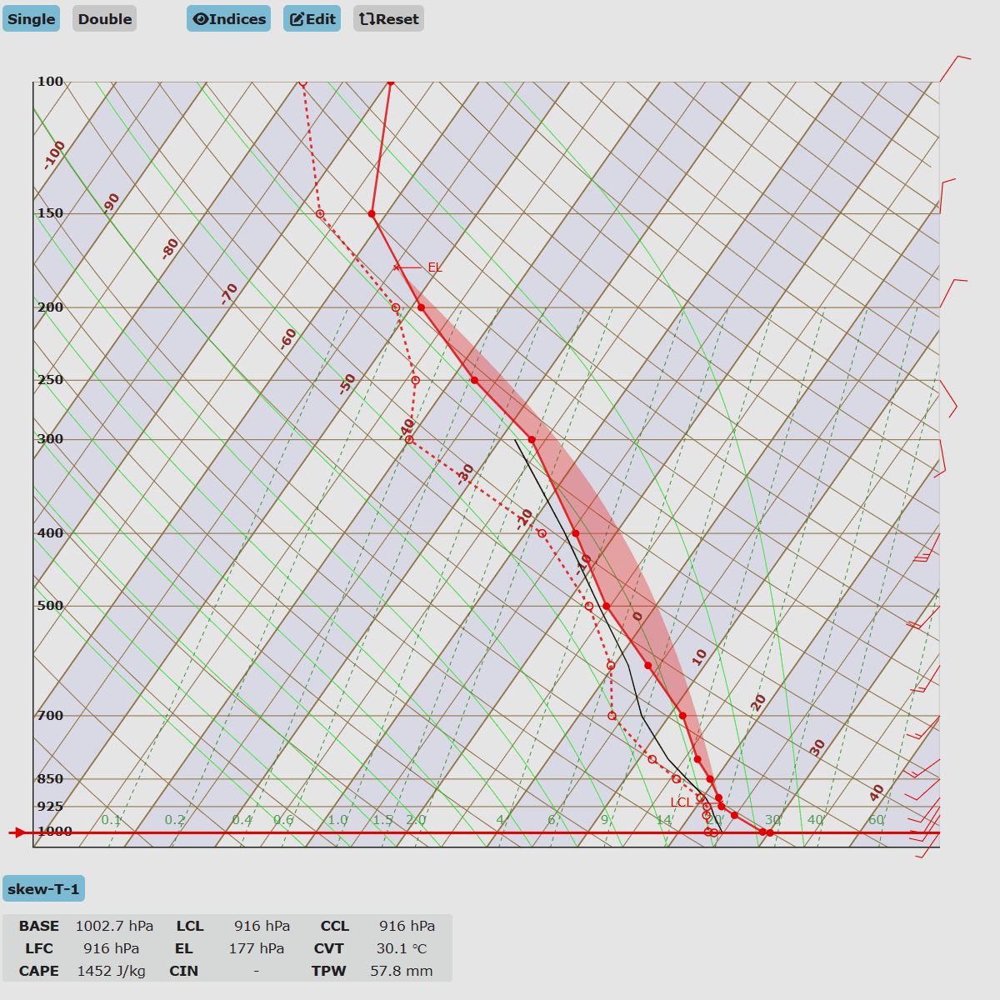

# skewt-meteogram-web

It is a open-source leaflet plugin which generate the vector tiles(canvas) for geojson data in proj4 coordinates.
(support only for polygon and multipolygon at this time)

## Dependency
- [d3.js] (https://d3js.org/)

## Demo

[DEMO] (https://hunter3789.github.io/leaflet-geojson-proj4-vectortile/example/demo.html)


## Installation and setup

- Quick use:

```js
<link rel="stylesheet" href="[path to css]/skewt.css" />
<script src="[path to js]/SkewT.js.js"></script>
<script src="[path to js]/skewt_function.js.js"></script>
```

## Usage
0. Slice geojson data by longitude (**if needed, for certain projection, usually don't need**)
```
var newGeojson = sliceGeojson(geojson, longitude);

// projection(example) : "+proj=eqc +lat_0=0 +lat_ts=0 +lon_0=126 +x_0=0 +y_0=0 +ellps=WGS84 +units=m +no_defs"
```
1. **Calculate min/max bounds of each polygons from geojson**
```
/**
* Initializes a dynamic Skew-T Log-P diagram visualizer.
* @param {string|HTMLElement} chartContainer - The container element or ID where the Skew-T chart will be rendered.
* @param {string|HTMLElement} tooltipContainer - The container element or ID for the interactive hover data.
* @param {number} [overlays=1] - The number of sounding profiles to overlay on a single diagram.
* @param {boolean} [showMenu=true] - Toggle to enable/disable the advanced menu panel (thermodynamic indices, manual sounding editor, reset controls).
**/
var skewt = new SkewT(chartContainer, tooltipContainer, tableContainer, overlays);

/**
* Initializes a dynamic Skew-T Log-P diagram visualizer.
* @param {string|HTMLElement} chartContainer - The container element or ID where the Skew-T chart will be rendered.
* @param {string|HTMLElement} tooltipContainer - The container element or ID for the interactive hover data.
* @param {number} [overlays=1] - The number of sounding profiles to overlay on a single diagram.
* @param {boolean} [showMenu=true] - Toggle to enable/disable the advanced menu panel (thermodynamic indices, manual sounding editor, reset controls).
**/
skewt.plot(skew_data, drawIndices, useEdit);
```
2. **Draw Tiles (draw polygons in which boundaries and tiles overlap.)**

```
L.geoJson.projvt(geojson, options).addTo(map);

// options(example) : {tileSize:512, pane:pane, color: "black", fillColor: "#ffffe5", weight: 1, simplify:true, tolerance:1}
```
- **select proper tileSize** for better performance
- simplify option is for polyline simplification, tolerance option is smooth parameter.

## Data (example)


## License

[LICENSE](LICENSE)
